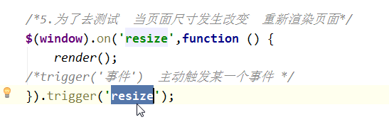
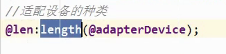
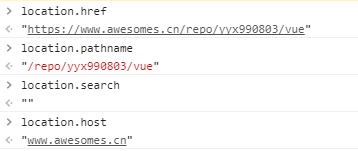
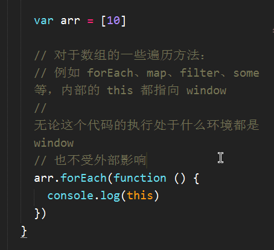
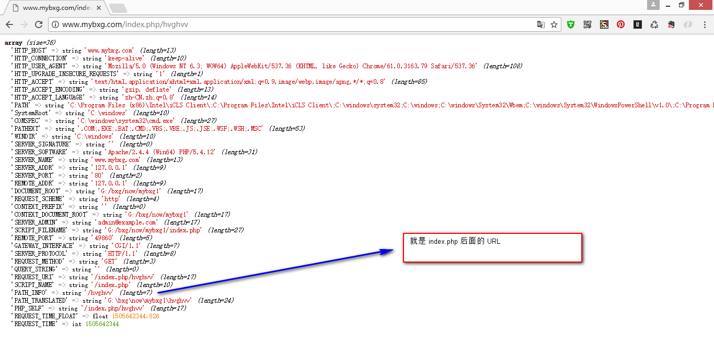
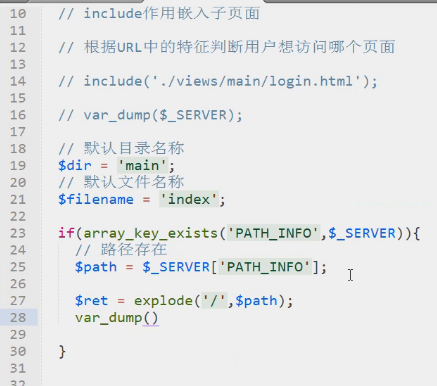
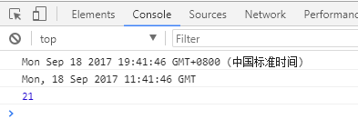

## 01、DOM获取宽度

width() 获取宽度

innerWidth()  获取宽度  内容+内边距

outerWidth()   获取宽度   内容+内边距+边框

outerWidth()    获取宽度    内容+内边距+边框+外边距

## 02、onresize

为了测试当页面发生改变时 重新渲染页面



## 03、less内置函数

获取数组长度：length(数组名)



@index 数组序号  从1开始

extract(数组名,@index)

## 04、location获取地址

window.location.href 获取当前地址

window.location.search 获取地址 “ ？” 后面的字符串

window.open("网址","_blank")  新窗口打开网址

location.pathname  获取当前地址



## 05、关于数组的遍历方法内部this都指向window



## 06、var se=fn 和var se= fn() 的区别

加了 () 后叫做函数的调用  调用完了后是有一个返回值的 如果没有return就是undefined  此时拿到的是一个值不能再进行调用   不加括号是return的这个函数 拿到这个函数后还可以进行调用( se() )   

## 07、什么是API

application programming interface    应用程序编程接口  

UI ：user interface  用户界面

UE：user experience   用户交互(体验)

## 08、php 语法

`var_dump()`  页面打印

`$_SERVER`  全局变量 ( 里面包括当前页面的URL )

`var_dump($_SERVER)`



`array_key_exists()`   判断某个数组中是否存在指定的 key  如果该 key 存在  则返回 true  否则返回  false 

`array_key_exists('PATH_INFO',$_SERVER)`   判断在 $_SERVER 中是否存在 PATH_INFO

`explode()`   使用一个字符串分隔另一个字符串   并返回由字符串组成的**数组**



`count(array)`   计算数组的长度

## 09、jQuery return false 

jQuery 里面的函数内 return false  既阻止事件冒泡又阻止跳转  阻止默认行为 

原生 JS 里面 只阻止默认行为不阻止事件冒泡

## 10、 jQuery 的serialize()方法

jQuery的serialize()方法通过序列化表单值，创建URL编码文本字符串，我们就可以选择一个或多个表单元素，也可以直接选择form将其序列化

```html
<form action="">
First name: <input type="text" name="FirstName" value="Bill" /><br />
Last name: <input type="text" name="LastName" value="Gates" /><br />
</form>
```

```javascript
$(document).ready(function(){
    console.log($("form").serialize()); // FirstName=Bill&LastName=Gates
});
```

这样就可以把序列化的值传给ajax()作为url的参数，轻松使用ajax()提交form表单了，而不需要一个一个获取表单中的值然后传给ajax()   例：

```javascript
$.ajax({
    type: 'post',
    url: 'your url',
    data: $("form").serialize(),
    success: function(data) {
        // your code
    }
});
```

11、cookie 操作

cookie 的操作： 获取 cookie 、设置 cookie

cookie 的存储数据量限制 ： 4kByte  4096 个英文字符

设置 cookie ： `document.cookie="name=zs"`

cookie 分类 ：

1、会话 cookie   :  数据存储在内存  浏览器关闭后就消失了

2、持久 cookie   :  数据存储在浏览器指定的文件中  过期之后消失

cookie 常用的属性：

`expires`  cookie 有效期

`path` 表示路径   **注：在父路径下设置的 cookie 子路径可以获取到  反之不可以**

- 设置 cookie 

```javascript
var date = new Date();
console.log(date);  
console.log(date.toGMTString())
console.log(date.getDate()+3);
```



```javascript
document.cookie = 'age=12; expires=' + date.toGMTString();
document.cookie = 'abc=123; path=/; exptres=' + date.toGMTString();
```

- 获取 cookie 

```javascript
console.log(document.cookie);
```

封装一个方法获取指定的 cookie 

```javascript

```

封装一个方法设置cookie

```javascript

```

## 12、JSON.stringify() 和 JSON.parse()

JSON.stringify() 就是将对象或者说是 JSON 对象转换成字符串

JSON.parse()  就是将字符串转换成 json 对象


```javascript
JSON.stringify(value[,replacer[,space]])
```

`value` : 就是要转换的有效的对象  

`replacer` : 可选  用于转换结果的函数或者数组    它又分为两种方式  一种是方法 一种是数组

- 如果 replacer 为函数 则 JSON.stringify 将调用该函数  并传入每个成员的键和值  使用返回值而不是原始值  如果此函数返回 undefined 则排除成员   根对象的键是一个空字符串 ："";
- 如果 replacer 是一个数组  则转换该数组中具有键值的成员  成员的转换顺序与键在数组中的顺序一样  当 value 参数也是数组时  将忽略 replacer 数组

`space` : 可选  文本添加缩进、空格和换行符   就是相当于分隔符

- 如果省略的话  那么显示出来的值 就没有分隔符  直接输出来
- 如果是一个数字的话  那么它就定义缩进几个字符   当然 如果大于 10  则最大值为 10 
- 如果是一些转义字符 比如 “ \t  ” 表示回车 那么它每行一个回车 
- 如果仅仅是字符串 就在每行输出值的时候把这些字符串附加上去就可以 当然 最大长度也是 10 个字符。

返回值：返回包含 JSON 文本的字符串

例1： 只有一个参数的情况 直接转换成字符串输出

```javascript
var str = {
  "name":"kobe",
  "number":24
}
var str1 = JSON.stringify(str)  // =>  只有一个参数的情况

console.log(str)
console.log(str1)
```


```javascript
var str2 = JSON.stringify(str,null,4)    // 使用 4 个空格缩进 
```


例2：第二个参数存在  并且第二个参数是 function 

```javascript
var student = new Array();
student[0] = "k";
student[1] = "o";
student[2] = "b";
student[3] = "e";
var json = JSON.stringify(student,fn);

function fn(k,value){
  return value.toString().toUpperCase();
}

console.log(json)   //  => "K,O,B,E"

//也可以写成下面的写法
//	var json = JSON.stringify(student,function(k,value){
//  	return value.toString().toUpperCase();
//	})
```

例3：第二个参数存在 并且第二个参数不是 function 而是数组

```javascript
// 注！如果第一个参数是数组  第二个参数也是数组的时候 只显示第一个参数的值
var student = new Array();
student[0] = "k";
student[1] = "o";
student[2] = "b";
student[3] = "e";

var stu = new Array()
stu[0] = "2";
stu[1] = "4";

var json = JSON.stringify(student,stu);
console.log(json)
```


```javascript
//如果第一个是对象第二个是数组  那么 如果第二个的 value 在第一个存在  那么就以第二个的值做 key 第一个值为 value 进行表示

var student = new Object();
student.qq = "123456";
student.name = "zs";
student.age = 12;

var stu = new Array();
stu[0] = "qq";
stu[1] = "age";
stu[2] = "Hi";   // 这个 student 对象里不存在

var json =JSON.stringify(student,stu);
console.log(json)

// 因为 stu[2] = "Hi"  这个 Hi 在第一个找不到  所以就不进行显示了 
```


例4：第三个参数

- 第三个值如果省略  那么显示出来的值就没有分隔符  直接输出出来  比如：

```javascript
var student = new Object();
student.qq = "123456";
student.name = "ko";
student.age = 24;
 
var stu = new Array();
stu[0] = "qq";
stu[1] = "age";
stu[2] = "Hi";
var json = JSON.stringify(student,stu);
console.log(json)
```


- 如果是一个数字的话 那就定义缩进几个字符 如果大于10 则最大值为10

```javascript
var student = new Object();
            student.qq = "548";
            student.name = "Lanny";
            student.age = 25;
 
            var stu = new Array();
            stu[0] = "qq";
            stu[1] = "age";
            stu[2] = "Hi";
 
            var json = JSON.stringify(student,stu,100);//注意这里的100
            console.log(json);     // =>   { 
									//			"qq":"548","age":25
									//		}
//空开了 10 个字符
```

- 如果是一些转义字符，比如“\r”，表示回车，那么它每行一个回车。
- 如果仅仅是字符串  就在每行输出值的时候把这些字符串附加上去就可以  最大长度也是10个字符。

```javascript
var student = new Object();
            student.qq = "548";
            student.name = "Lanny";
            student.age = 25;
 
            var stu = new Array();
            stu[0] = "qq";
            stu[1] = "age";
            stu[2] = "Hi";

var json = JSON.stringify(student,stu,"haha");
console.log(json)
```


```javascript
JSON.parse(text[,reviver])
```

`text` :  必须参数 一个有效的 JSON 字符串

`reviver`  :  可选  一个转换结果的函数  将为对象的每个成员调用此函数

例：

```javascript
var set = JSON.parse('{"k":1,"o":2,"b":3,"e":4}')
	console.log(set)   //  => {"k":1,"o":2,"b":3,"e":4}  object

JSON.parse('{"p":5}',function(k,v){
  if(k === ''){
    return v
  }else{
    return v*2;
  }
})

JSON.parse('{"1":1,"2":2,"3":{"4":4,"5":{"6":6}}}',function(k,v){
  console.log(k)    // 输出当前属性 最后一个为 ""
  return v;       //返回修改的值
})
```


  